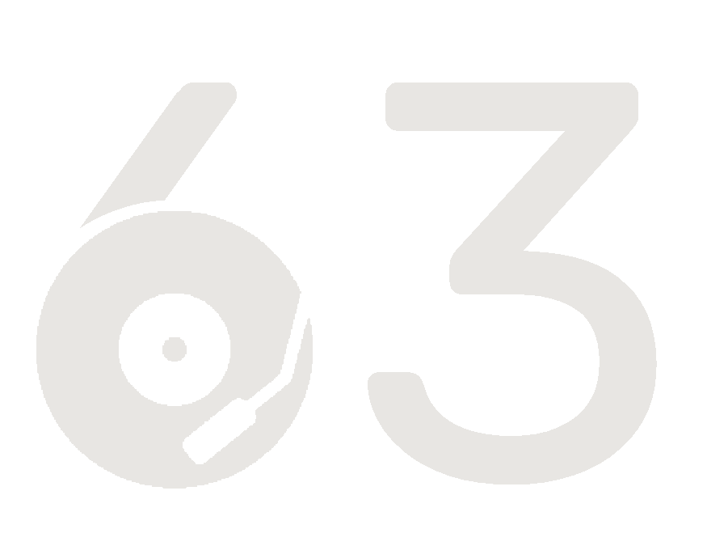

<h1 align="center">RadioWęzeł63</h1>

  
  English README

# Bugs:

* Vote elements might duplicate when reviving songs from history

# ToDo:

* lyrics analyzer
* auto vote on added song
* pretty README

  
  Polskie README

# Strona główna:

Menu:\
Dla najwyższej roli w menu są dostępne następujące opcje:
* [Admin panel](#admin-panel)
* [Odtwarzacz](#odtwarzacz)
* [Użytkownicy](#użytkownicy)
* Historia
* Ustawienia
* Wyloguj

Głosy:\
Głosować mogą tylko zalogowani użytkownicy. Piosenki są odtwarzane w kolejności od mających najwyższą ilość głosów do tych z najniższą.

Dodawanie piosenek:\
Piosenki są dodawane z youtube music i zanim będą na głównej stronie muszą przejść weryfikacje administratorów.

Administratorzy mogą również usuwać piosenki które są na głównej stronie. Przytrzymując ikonkę jakiejkolwiek piosenki na każdej z ikonek pojawi się kosz:

klikając na kosz piosenka jest usuwana z głównej strony i pojawia się na stronie z historią.

# Admin panel

Odrzucenie piosenki:\
Jeżeli piosenka jest pod jakimś względem nieodpowiednia do odtworzenia należy ją usunąć tym przyciskiem.

Zaakceptowanie piosenki:\
Jeżeli piosenka jest odpowiednia do odtworzenia należy zaakceptować ją tym przyciskiem. Wtedy pojawi się na stronie głównej i będzie można na nią głosować.

Link do piosenki:\
otwiera link z daną piosenką.

Wyświetlenie tekstu piosenki:\
Wczytuje tekst piosenki z google.

# Odtwarzacz

**Ta strona może być używana przez tylko jedną osobę naraz**

Rozpocznij kolejkę / następna piosenka:\
jeżeli od uruchomienia aplikacji nie została odtworzona żadana piosenka rozpoczyna odtwarzanie. Jeżeli aktualnie jest odtwarzana jakaś piosenka odtwarza następną. Piosenki które zostały odtworzone pojawiają się w historii.

Odtwórz / Wstrzymaj:\
Zatrzymuje lub kontynuuje odtwarzaną piosenkę.

Surowy youtube iframe:\
Wyświetla iframe który odtwarza piosenkę i logi.
(przydatne jeżeli są problemy z domyślnym odtwarzaczem)

Mały Admin panel:\
Jest to tym samym co [Admin panel](#admin-panel) tylko że na stronie z odtwarzaczem.

# Użytkownicy

Rola użytkownika:\
W aplikacji dostępne są 4 role:
* user: może dodawać i głosować na piosenki
* moderator: może używać admin panelu
* admin: może to co user i moderator oraz ma dostęp do: Odtwarzacza, Użytkowników, Historii i Ustawień
* developer: może wszystko

Nadanie wyższej roli / Obniżenie roli:\
Każdy mający dostęp do strony Użytkownicy może awansować i deawansować wszystkich użytkowników którzy są conajmniej o rolę niżej od ich nich.

